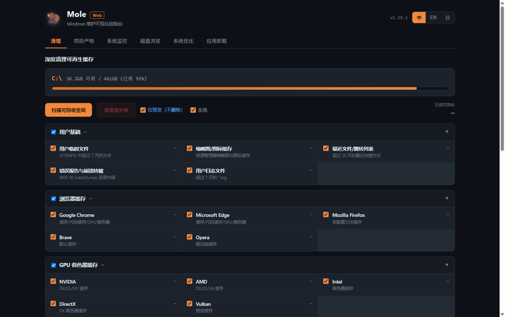
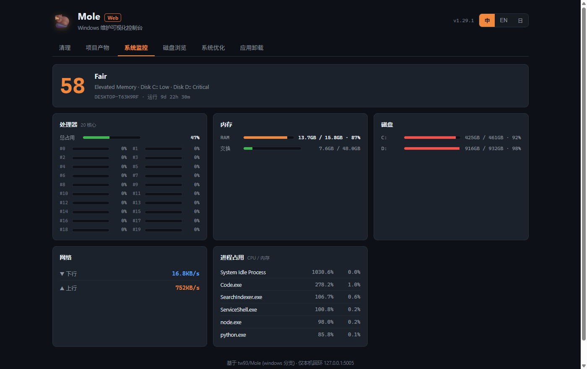

<div align="center">

# 🦫 Mole

**All-in-one Windows cleanup & maintenance — six tools in one.**

[](https://github.com/shushuitie2017/mole-desktop/releases/latest)
[](https://mole.bluecatbot.com)
[](LICENSE)
[](https://mole.bluecatbot.com)

[中文](#中文) · [English](#english) · [日本語](#日本語)



</div>

---

<a name="中文"></a>
## 中文

**Mole** 是一款 Windows 一体化系统维护桌面应用。CCleaner、WinDirStat、IObit Uninstaller、任务管理器——四个工具的活，一个 Mole 全包。**下载安装即用，无需安装任何 Python / 依赖环境。**

### ✨ 六大功能
| 功能 | 说明 |
|------|------|
| 🧹 **深度清理** | 用户 / 浏览器 / GPU / 应用 / 开发者 / 残留缓存，46 个类别一键扫描回收 |
| 📦 **项目产物清理** | 一键清理 `node_modules` / `target` / `dist` / `.next` 等构建产物，按项目分组 |
| 📊 **实时系统监控** | CPU 逐核、内存、磁盘、网络速率、Top 进程，附健康评分，2 秒刷新 |
| 🗂️ **磁盘空间浏览** | 目录逐层钻取，大小条形可视化，快速定位大文件，可直接删除 |
| ⚡ **系统优化与修复** | 刷新 DNS、重建图标缓存、重置 Winsock / 商店、磁盘健康检查、sfc 修复 |
| 🗑️ **应用卸载** | 列出已装应用（大小 / 发行商），过滤系统组件，调用原生卸载器彻底清除 |

### 🎯 优势
- **下载即用，零依赖** —— Python 运行时已内置，双击安装即可使用。
- **安全护栏，绝不误删** —— 受保护路径白名单 + 文件年龄阈值，删除前默认「仅预览」，永不触碰系统关键目录。
- **开发者友好** —— 一键清空堆积的 `node_modules`、构建产物与 npm / pip / cargo / go 缓存。
- **三语界面** —— 中文 / English / 日本語 一键切换，暗色专业 UI。
- **开源 · 自动更新** —— 代码可审计，内置自动更新。

### 📥 下载安装
1. 从 **[官网](https://mole.bluecatbot.com)** 或 **[GitHub Releases](https://github.com/shushuitie2017/mole-desktop/releases/latest)** 下载 `Mole-Setup-x.y.z.exe`。
2. 双击安装（可自选目录）。
3. 首次启动点击 UAC「是」授权管理员，解锁全部功能。
4. 先「扫描」预览可回收空间，确认后一键清理。

> ⚠️ 删除操作不可逆。建议先用「仅预览」查看，确认无误再执行。

### 🛡️ 安全
每一次删除都经过**受保护路径校验**与**年龄阈值过滤**；系统目录（Windows、System32、Program Files、Defender）永远在白名单之外；所有破坏性操作默认「仅预览」。

---

<a name="english"></a>
## English

**Mole** is an all-in-one Windows maintenance desktop app. CCleaner, WinDirStat, IObit Uninstaller, Task Manager — the job of four tools, in one Mole. **Download, install, and go — no Python or dependencies required.**

### ✨ Six modules
| Module | Description |
|--------|-------------|
| 🧹 **Deep Clean** | User / browser / GPU / app / developer / leftover caches — 46 categories, one-click scan & reclaim |
| 📦 **Project Artifacts** | Purge `node_modules` / `target` / `dist` / `.next` build artifacts, grouped by project |
| 📊 **Live Monitor** | Per-core CPU, memory, disk, network rates, top processes, health score — refreshes every 2s |
| 🗂️ **Disk Explorer** | Drill into folders, visualize sizes, find large files, delete in place |
| ⚡ **Optimize & Repair** | Flush DNS, rebuild icon cache, reset Winsock / Store, disk health check, sfc repair |
| 🗑️ **Uninstaller** | List installed apps (size / publisher), filter system components, launch native uninstaller |

### 🎯 Highlights
- **Zero dependencies** — the Python runtime is bundled; just double-click to install.
- **Safety first** — protected-path whitelist + file age thresholds; defaults to *Preview only*; never touches critical system folders.
- **Developer-friendly** — wipe piled-up `node_modules`, build artifacts, and npm / pip / cargo / go caches in one click.
- **Trilingual** — 中文 / English / 日本語, dark professional UI.
- **Open source & auto-update** — auditable code, built-in updater.

### 📥 Download & Install
1. Get `Mole-Setup-x.y.z.exe` from the **[website](https://mole.bluecatbot.com)** or **[GitHub Releases](https://github.com/shushuitie2017/mole-desktop/releases/latest)**.
2. Run the installer (custom directory optional).
3. On first launch click **Yes** on the UAC prompt to grant admin and unlock all features.
4. **Scan** first to preview reclaimable space, then clean.

> ⚠️ Deletion is irreversible. Use *Preview only* first to confirm.

### 🛡️ Safety
Every deletion passes a **protected-path check** and **age-threshold filter**; system folders (Windows, System32, Program Files, Defender) are always excluded; all destructive actions default to *Preview only*.

---

<a name="日本語"></a>
## 日本語

**Mole** は Windows 向けオールインワンのメンテナンス用デスクトップアプリです。CCleaner、WinDirStat、IObit Uninstaller、タスクマネージャー——4 つのツールの仕事を Mole 1 つで。**ダウンロードしてインストールするだけ、Python や依存環境は一切不要です。**

### ✨ 6 つの機能
| 機能 | 説明 |
|------|------|
| 🧹 **ディープクリーン** | ユーザー / ブラウザ / GPU / アプリ / 開発 / 残留キャッシュ、46 カテゴリをワンクリックで回収 |
| 📦 **成果物クリーン** | `node_modules` / `target` / `dist` / `.next` などをプロジェクト別に一括削除 |
| 📊 **リアルタイム監視** | コア別 CPU・メモリ・ディスク・ネットワーク・上位プロセス、健康スコア付き、2 秒更新 |
| 🗂️ **ディスク探索** | フォルダを掘り下げ、サイズを可視化、大きいファイルを特定して削除 |
| ⚡ **最適化と修復** | DNS フラッシュ、アイコンキャッシュ再構築、Winsock / ストア初期化、ディスク健全性、sfc 修復 |
| 🗑️ **アンインストール** | インストール済みアプリ一覧（サイズ / 発行元）、システム部品を除外、標準アンインストーラを起動 |

### 🎯 特長
- **依存ゼロ** —— Python ランタイム同梱、ダブルクリックでインストール。
- **安全第一** —— 保護パスのホワイトリスト + ファイル経過日数のしきい値、既定は「プレビューのみ」、重要なシステムフォルダには触れません。
- **開発者向け** —— 溜まった `node_modules`・成果物・npm / pip / cargo / go キャッシュをワンクリックで一掃。
- **3 言語対応** —— 中文 / English / 日本語、ダークなプロ仕様 UI。
- **オープンソース・自動更新** —— 監査可能なコード、自動アップデート内蔵。

### 📥 ダウンロードとインストール
1. **[公式サイト](https://mole.bluecatbot.com)** または **[GitHub Releases](https://github.com/shushuitie2017/mole-desktop/releases/latest)** から `Mole-Setup-x.y.z.exe` を入手。
2. インストーラーを実行（インストール先は選択可）。
3. 初回起動で UAC の「はい」をクリックして管理者権限を付与し、全機能を解放。
4. まず「スキャン」で回収可能な容量を確認してから実行。

> ⚠️ 削除は元に戻せません。まず「プレビューのみ」で確認してください。

### 🛡️ 安全性
すべての削除は**保護パスのチェック**と**経過日数フィルター**を通過します。システムフォルダ（Windows、System32、Program Files、Defender）は常に対象外で、破壊的な操作は既定で「プレビューのみ」です。

---

<div align="center">

## 🛠️ Build from source / 从源码构建 / ソースからビルド

</div>

```bash
# 1. Dependencies / 依赖 / 依存
npm install
pip install -r python/requirements.txt pillow

# 2. Generate icon / 生成图标 / アイコン生成
python scripts/make_icon.py

# 3. Dev run / 开发运行 / 開発実行  (spawns local Python backend)
npm start

# 4. Build backend exe / 构建后端 / バックエンド (PyInstaller --onedir)
npm run build-backend

# 5. Build installer / 出安装包 / インストーラー (NSIS)
npm run dist            # -> dist/Mole Setup x.y.z.exe
```

**Stack:** Electron + PyInstaller · Flask + psutil backend · vanilla JS frontend.
**Architecture:** Electron main process spawns the bundled PyInstaller `server.exe` (Flask, `127.0.0.1`), the window loads the local UI.

> Windows build tip: if `npm run dist` loops on a *winCodeSign symbolic link* error, enable **Windows Developer Mode** (one-time) so non-admin symlink creation works.

<div align="center">

### 📊 Live system monitor / 实时监控 / リアルタイム監視


---

**[🌐 mole.bluecatbot.com](https://mole.bluecatbot.com)** · MIT License · Made with 🦫

</div>
